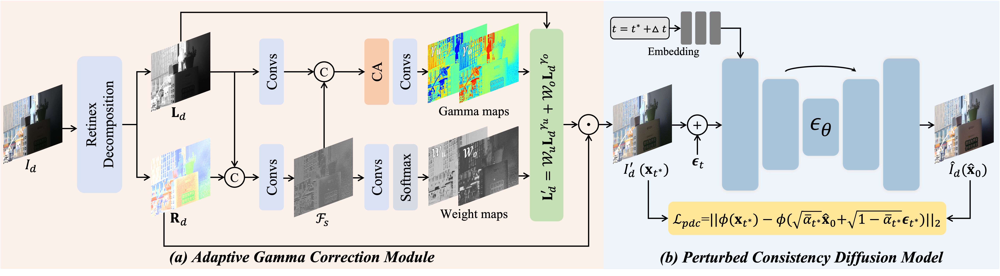

# [[CVPR 2026]]() ZeroIDIR: Zero-Reference Illumination Degradation Image Restoration with Perturbed Consistency Diffusion Models
<h4 align="center">Hai Jiang<sup>1</sup>, Zhen Liu<sup>2</sup>, Yinjie Lei<sup>3</sup>, Songchen Han<sup>1</sup>, Bing Zeng<sup>2</sup>, Shuaicheng Liu<sup>2</sup></center>
<h4 align="center">1.School of Aeronautics and Astronautics, Sichuan University</center></center>
<h4 align="center">2.University of Electronic Science and Technology of China,</center></center>
<h4 align="center">3.College of Electronics and Information Engineering, Sichuan University</center></center>

## Overall pipeline


## Dependencies
```
pip install -r requirements.txt
````

## Download the raw training and evaluation datasets
### LLIE datasets
#### - Paired datasets 
- LOL dataset: Chen Wei, Wenjing Wang, Wenhan Yang, and Jiaying Liu. "Deep Retinex Decomposition for Low-Light Enhancement". BMVC, 2018. [[Project Page]](https://daooshee.github.io/BMVC2018website/)

- LSRW dataset: Jiang Hai, Zhu Xuan, Ren Yang, Yutong Hao, Fengzhu Zou, Fang Lin, and Songchen Han. "R2RNet: Low-light Image Enhancement via Real-low to Real-normal Network". Journal of Visual Communication and Image Representation, 2023. [[Baiduyun (extracted code: wmrr)]](https://pan.baidu.com/s/1XHWQAS0ZNrnCyZ-bq7MKvA)

- MIT5K dataset: Vladimir Bychkovsky, Sylvain Paris, Eric Chan, and Fr´edo Durand. "Learning photographic global tonal adjustment with a database of input/output image pairs". CVPR, 2011. [[Project Page]](https://data.csail.mit.edu/graphics/fivek)

### BIE datasets
- BAID dataset: Xiaoqian Lv, Shengping Zhang, Qinglin Liu, Haozhe Xie, Bineng Zhong, and Huiyu Zhou. "Backlitnet: A dataset and network for backlit image enhancement". Computer Vision and Image Understanding, 2022. [[Project Page]](https://github.com/lvxiaoqian/BacklitNet)

- Backlit300 dataset: Zhexin Liang, Chongyi Li, Shangchen Zhou, Ruicheng Feng, and Chen Change Loy. "Iterative prompt learning for unsupervised backlit image enhancement". ICCV, 2023. [[Project Page]](https://github.com/ZhexinLiang/CLIP-LIT)

### MSEC datasets
- MSEC dataset: Mahmoud Afifi, Konstantinos G Derpanis, Bjorn Ommer, and Michael S Brown. "Learning multi-scale photo exposure correction". CVPR, 2021. [[Project Page]](https://github.com/mahmoudnafifi/Exposure_Correction)

- SICE dataset: Jianrui Cai, Shuhang Gu, and Lei Zhang. "Learning a deep single image contrast enhancer from multi-exposure images". IEEE TIP, 2018. [[Project Page]](https://github.com/csjcai/SICE)

### Real-world datasets
Please refer to [Project Page of RetinexNet](https://daooshee.github.io/BMVC2018website/).

## Pre-trained Models 
You can download our pre-trained model from [[OneDrive]]() and [[Baidu Yun (extracted code:)]]()

## How to train?
You need to modify ```dataset/dataloader.py``` slightly for your environment, and then
```
python train.py  
```

## How to test?
```
python inference.py
```

## Visual comparison

## Citation
If you use this code or ideas from the paper for your research, please cite our paper:
```

```

## Acknowledgement
Part of the code is adapted from the previous work: [denoising-diffusion-pytorch](https://github.com/lucidrains/denoising-diffusion-pytorch). We thank all the authors for their contributions.

